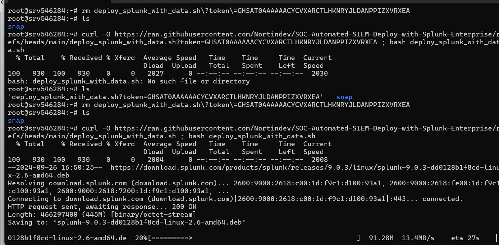
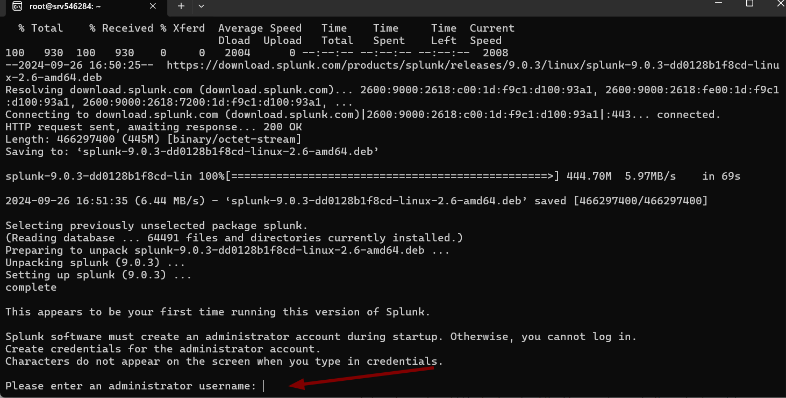
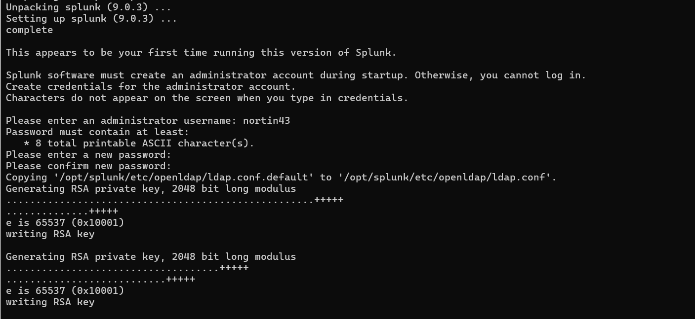
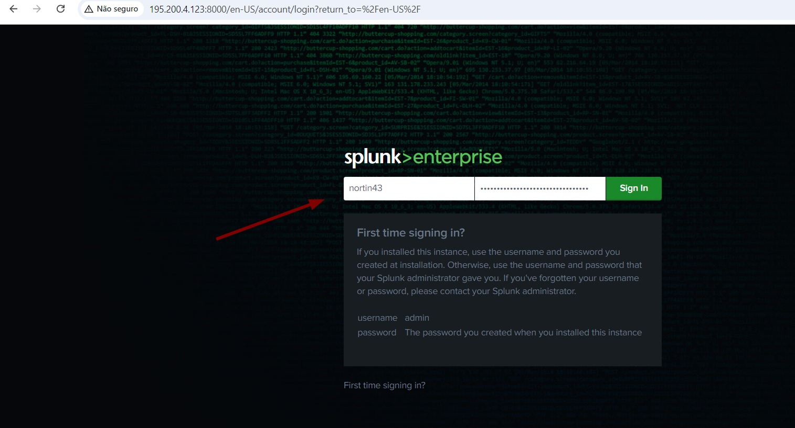
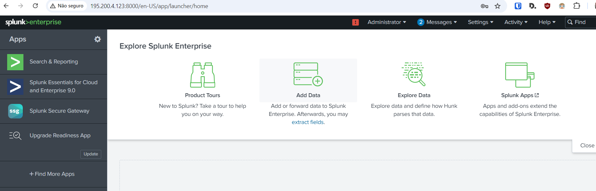

# SOC Automated SIEM Deploy with Splunk Enterprise

This project provides an automated script to deploy **Splunk Enterprise** on a VPS in under 5 minutes. This is ideal for SOC analysts who want to quickly set up a lab environment for training and skill improvement.

---

## Features

- **Quick Splunk Enterprise Deployment**: Install and configure Splunk Enterprise on a VPS in less than 5 minutes.
- **Automation**: The script simplifies the process, making it easier to get Splunk up and running without manual steps.

---

## IMPORTANT INFORMATION

**This script is valid for Debian/Ubuntu-based systems**:  
   For other distributions, such as **RHEL9**, you will need to adapt the download link to match the correct package format. You can find the appropriate package for your operating system on the [Splunk Downloads Page](https://www.splunk.com/en_us/download.html).

---

## Prerequisites

- A Linux-based VPS with root or sudo privileges.
- **wget** and **unzip** installed on the system.
- Internet access for downloading Splunk and tutorial data.

---

## Script Usage

### Steps to Deploy Splunk Enterprise

1. If you wish to deploy Splunk Enterpise ***WITHOUT DATA***, use this script:
   ```bash
   curl -O https://raw.githubusercontent.com/Nortindev/SOC-Automated-SIEM-Deploy-with-Splunk-Enterprise/refs/heads/main/deploy_splunk_without_data.sh ; bash deploy_splunk_without_data.sh
   ```

***The installation will begin***



***You can setup your user and password***:



***Done! Now you can already login to Splunk Enteprise on your VPS IP, make sure to have port 8000 open, http://VPS IP:8000***








***DISCLAIMER**

Please note that the license which is agreed to install with this script is just the trial version made available by Splunk for training purposes. If you wish to aquire the full license that has more features, please do so in the official site: https://www.splunk.com/en_us/products/splunk-enterprise.html


